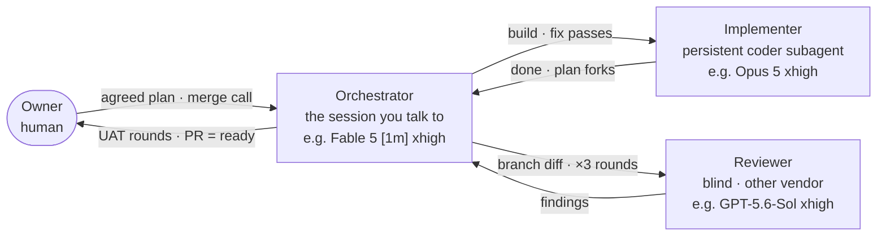
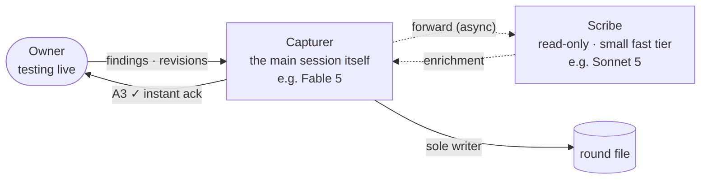

# agent-workflow

Device-level agent skills for my personal development workflow. These encode
**policy and orchestration** — models, efforts, loop phases, decision rights —
and deliberately live *outside* any project repo: repos stay workflow-agnostic
and only carry facts (gate commands, seeds, red lines) in their own agent docs.

## Skills

### `paseo-dev-loop` — the execution pipeline

Any agreed coded change: build → exit-code gate → three blind review rounds →
owner UAT → PR-as-ready. One orchestrator session drives; work is delegated to
persistent subagents.



| Role | What it does | Ideal tier (e.g., our profiles) |
|---|---|---|
| **Orchestrator** — the session you talk to | drives the loop: delegates, runs gates, triages plan forks, reports; never writes code | frontier + long context — Fable 5 [1m] |
| **Implementer** — persistent subagent | builds the plan (TDD, incremental); stops and waits on plan forks | strongest coder — Opus 5 xhigh |
| **Reviewer** — persistent subagent | reviews the branch diff blind, re-prompted each round | different vendor than implementer — GPT-5.6-Sol xhigh |
| **Owner** | UAT, rulings, the merge call | human |

Diffs touching auth or a declared red line also get an independent security
pass as its own subagent (skill §4). Independent changes can run parallel
loops — each with its own implementer and reviewer; within a single change
there is one implementer.

### `feedback-round` — live testing capture

The owner tests and talks; **capture never blocks, investigation never
interrupts.**



The capturer is the main session, sole writer of `.feedback/round-<X>.md`;
the scribe is one persistent read-only subagent per round, deliberately a
small fast tier (Scribe profile, Sonnet fallback) — speed is freshness, and
low blast radius.

## Requirements

Built to run on **Paseo** for maximum orchestration — persistent subagents,
agent profiles, finish/permission notifications. Every skill carries an
explicit degradation ladder, so missing pieces cost persistence and tuning,
never silent correctness shortcuts.

- **Minimum:** `git` + `bash` for the install, and an agent that discovers
  skills in `~/.agents/skills/` or `~/.claude/skills/` (Claude Code). That is
  enough for `feedback-round`; `paseo-dev-loop` additionally needs an
  independent reviewer — the `codex` CLI at minimum. With no independent
  reviewer at all, the review loop stops by design rather than self-review.
- **Recommended:** the [`agent-skills`](https://github.com/addyosmani/agent-skills)
  collection (Addy Osmani) — the technique layer these skills reference:
  `paseo-dev-loop`'s implementer skill packs and review lenses resolve from
  it. Any install route works: the Claude Code plugin, or `npx skills add`
  into the same `~/.agents/skills/` convention this repo's installer uses.
  Policy lives here, techniques live there ("reference, never restate");
  without them, Claude-side agents fall back to their built-in defaults.
- **Optimal:** the Paseo daemon with `paseo/agent-profiles.json` merged and
  both providers (claude, codex) available — subagents persist across turns,
  roles resolve from tunable profiles, and review runs cross-vendor.

## Install (per device)

```bash
git clone https://github.com/rucister/agent-workflow.git
bash agent-workflow/install.sh
```

Clone anywhere permanent — the installer resolves its own location, so the
symlinks point at wherever the working tree lives. Don't delete the clone
afterwards (it *is* the live skill source); if you move it, re-run
`install.sh` to re-point the links.

The installer symlinks every skill into `~/.agents/skills/` (the cross-agent
convention) and `~/.claude/skills/` (Claude Code discovery). The repo stays the
source of truth: editing a live skill edits this working tree — commit and push
from here, `git pull` elsewhere. Idempotent; safe to re-run after adding skills.

## Paseo profiles

`paseo/agent-profiles.json` is a reference copy of the `daemon.agentProfiles`
array these skills resolve against (Implementer / Reviewer / Orchestrator, with
"when to use" notes). On a new device, merge it into `~/.paseo/config.json`
under `daemon.agentProfiles`, then `paseo daemon reload` (or restart). The
skills degrade gracefully without it — hardcoded fallbacks carry the same
values — but profiles are the tuning layer.

## Authoring rules

- **Reference, never restate.** Techniques live in the referenced skills
  (agent-skills plugins, the `paseo` skill); these files carry only policy.
  A section that starts teaching a technique is duplication — replace it with
  the reference.
- **Roles, not models.** Models appear in exactly two places: Paseo profiles
  (tunable) and fallback tables (frozen safety net). Everywhere else speaks in
  roles (implementer, reviewer, scribe).
- **Repos own their facts.** Never add a project-specific command or path here;
  the skills gather bindings from each repo's own agent docs.
